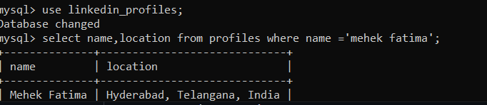

# LinkedIn Profile Scraper

## Description

The LinkedIn Profile Scraper is a Chrome extension that extracts information from LinkedIn profiles and sends it to a Node.js server for storage in a MySQL database. This tool is designed for developers looking to gather profile data efficiently for analytics or other purposes.

## Features

- Scrapes essential data from LinkedIn profiles, including:
  - Name
  - URL
  - About section
  - Bio
  - Location
  - Connection count
- Stores scraped data in a MySQL database.
- Provides a simple API for data submission.

## Technologies Used

- **Frontend**: Chrome Extension (HTML, JavaScript)
- **Backend**: Node.js, Express
- **Database**: MySQL
- **ORM**: Sequelize

## Installation

1. Clone or download this repository to your local machine.
2. Open Google Chrome and go to `chrome://extensions/`.
3. Enable Developer mode by toggling the switch in the upper-right corner.
4. Click on the "Load unpacked" button and select the directory where you cloned or downloaded this repository.

## Setup Database

1. Install MySQL on your local machine if you haven't already. Follow the [MySQL installation guide](https://dev.mysql.com/doc/refman/8.0/en/installing.html) for your platform.
2. Create a new database for the scraper:
   ```sql
   CREATE DATABASE linkedin_scraper;
   ```
3. Use the following SQL commands to create the `profiles` table:
  ```sql
   CREATE TABLE profiles (
    id INT AUTO_INCREMENT PRIMARY KEY,
    name VARCHAR(255) NOT NULL,
    url VARCHAR(255) NOT NULL,
    about TEXT,
    bio TEXT,
    location VARCHAR(255),
    connectionCount INT,
    created_at TIMESTAMP DEFAULT CURRENT_TIMESTAMP
    );
  ```
4. cd to the backend 

5. Install the required Node.js dependencies:
   ```
    npm install express sequelize mysql2 cors body-parser
   ```
6. Start your Node.js server:
   ```js 
    node.js run server
   ``` 
## Demo

This image demonstrates how the scraped data appears in the MySQL database after being submitted from the Chrome extension.




